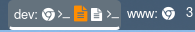

# niri-autoname-workspaces [](https://github.com/justbuchanan/niri-autoname-workspaces/actions/workflows/nix.yml)

This program automatically updates [niri](https://github.com/YaLTeR/niri) workspace names to show icons for running programs in your bar.



See a demo video on [reddit](https://www.reddit.com/r/unixporn/comments/1o7rzdl/oc_niri_addon_for_showing_window_icons_in_your_bar)

It's very similar in function to [workstyle](https://github.com/pierrechevalier83/workstyle/tree/main) and [swayest_workstyle](https://github.com/Lyr-7D1h/swayest_workstyle), but designed to work with the niri window manager.

## Installation

### Cargo

```
cargo install --git https://github.com/justbuchanan/niri-autoname-workspaces
```

### Nix

Add the flake to your system or home-manager configuration OR use nix profiles:

```
nix profile install github.com:justbuchanan/niri-autoname-workspaces
```

### Niri Configuration

Add this to your `~/.config/niri/config.kdl`:

```
spawn-at-startup niri-autoname-workspaces
```

Optionally add a keyboard shortcut for renaming the current workspace:

```
binds {
    Mod+R spawn-sh { "niri-autoname-workspaces rename" }
}
```

## Icon Customization

`niri-autoname-workspaces` comes with a default icon set at [icons.toml](./icons.toml), however you can customize them by creating a config file at `~/.config/niri/autoname-workspaces.toml`.
